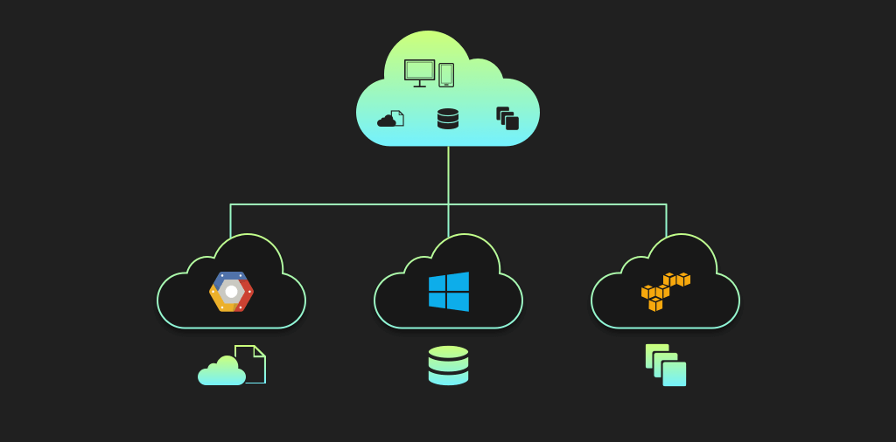

Title: Setting up a VPN connection between AWS and Alicloud using Terraform
Date: 2020-03-19 20:30
Modified: 2020-03-19 20:30
Category: AWS
Tags: aws, alicloud, terraform, vpn
Slug: aws-alicloud-vpn-setup-terraform
Authors: Ambar Mehrotra
Summary: Setting up a VPN connection between AWS and Alicloud using Terraform
Status: draft

> ___Note___:
> This is not a guide on the internals of a Virtual Private Network. Rather, this post outlines how to setup a VPN connection between AWS and Alicloud. This guide uses Terraform for making API calls and state management. You can chose to use any HTTP client or aws and alicloud CLIs as well for making the same API calls and end up with a working VPN connection.

Problem Statement
----------------
When you are working in a multicloud environment, many scenarios involve establishing a communication channel between services and resources that lie across cloud providers. For example, you might have a common __Rundeck__ machine that deployes the build binaries onto virtual machines residing in AWS as well as Azure. Another example might be a script in your CI/CD platform that interacts periodically with resources across cloud providers like __RDS__, __Mongo__, __RabbitMQ__, etc., for regularly monitoring or updating different ACL Policies.

Creating a VPN connection helps you securely access resources on one cloud provider from another over an encrypted connection. A VPN connection helps you avoid the hassle of exposing public endpoints for each resource and then securing it. You can simply go ahead and whietelist a CIDR block across the VPCs and all your traffic in the given CIDR range will then be routed over this secure, encrypted connection.

VPN Setup
---------
